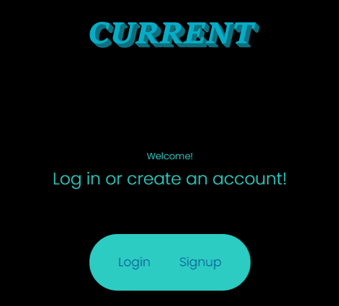

# **Current**

## **Thumbnail**

## **Description**

- This application can store all your relevent links (ex. LinkedIn, Github, Twitch channel) on an easy to use digial tile system.

## **Built With**

- REACT
- MongoDb
- Apollo

## **Table of Contents**

- [Installation](#installation)
- [Usage](#usage)
- [License](#license)
- [Contributing](#contributing)
- [Deployment](#deployment)

## **Installation**

- Download from Github

## **Usage**

- Create an account or log in if already signed up, and add your relevent data

## **License**

- Unlicense

## **Questions**

Made with ❤️💧🩸 by Isaac Gonzalez, Jonathan Franklin, Thomas McCalister, and Jared Ruiz

- www.github.com/JonCurls

## **Deployment**

https://desolate-crag-78193.herokuapp.com/
